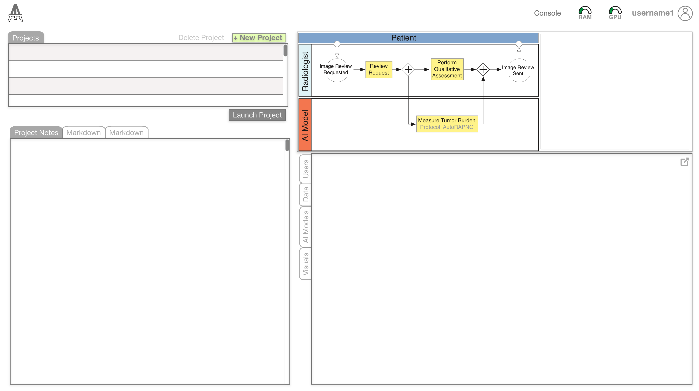

Welcome to EASL (Experimental Analytical Systems Lab; pronounced *easel*). A framework for developing explainable artificial intelligence-enabled clinical decision support systems (XAI-CDSS) and administering usability tests. The framework supports the following tasks: data import, model creation, visual interactive design, and testing.

## About

Detailed documentation for EASL functionality can be found at on the [wiki](https://github.com/LeRicNet/easl/wiki) or through the links below.

 -  [Data](https://github.com/LeRicNet/easl/wiki/Data-I-O)
 -  [Model](https://github.com/LeRicNet/easl/wiki/model)
 -  [Visualizations](https://github.com/LeRicNet/easl/wiki/vis)
 -  [User Studies](https://github.com/LeRicNet/easl/wiki/userstudies)

#### Portable and Modular Framework

#### Built-in PACS and Native Clinical Imaging Viewer

#### 

## Publications

### Backend/Frontend Interface
PHP and JavaScript backend provided by [Laravel](https://laravel.com/). Bootstrap theme template provided by [Start Bootstrap](https://startbootstrap.com/theme/sb-admin-2). Medical image viewing capabilities provided by the [Open Health Imaging Foundation (OHIF) Viewer](https://github.com/OHIF/Viewers). AI functionality developed using the [TensorFlow (TF) framework](https://www.tensorflow.org/) and associated ecosystem (i.e., [TFX](https://www.tensorflow.org/tfx), [TF.js](https://www.tensorflow.org/j)).

## Troubleshooting
Please report any issues, comments, or questions to Eric Prince via email Eric.Prince@CUAnschutz.edu, or [file an issue](https://github.com/LeRicNet/easl/issues).

## Acknowledgements
This work was supported by NIH/NCATS Colorado CTSA Grant Number TL1 TR002533. Contents are the authors’ sole responsibility and do not necessarily represent official NIH views. In addition, the authors wish to thank the [Morgan Adams Foundation for Pediatric Brain Tumor Research](https://www.morganadamsfoundation.org), the Children's Hospital Colorado Center for Children's Surgery and the National Library of Medicine for their support of this project.
This work was funded by the .

